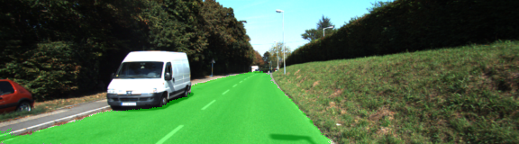
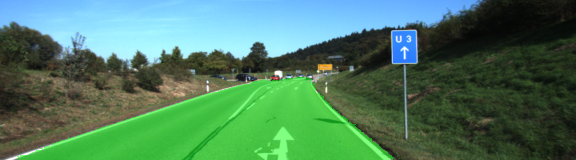

# Semantic Segmentation
### Introduction
In this project, you'll label the pixels of a road in images using a Fully Convolutional Network (FCN).

- keep_prob = 0.8 , l_rate = 0.00004

 
 


### 1 Build the Neural Network
1. vgg model
2. layers
3. optimize
 - optimizer = tf.train.AdamOptimizer(learning_rate = learning_rate)
 - train_op = optimizer.minimize(loss = cross_entropy_loss)
4. train_nn (4 pattern)
 - keep_prob = 0.8 , l_rate = 0.00001
 - keep_prob = 0.9 , l_rate = 0.00001
 - keep_prob = 0.8 , l_rate = 0.00004
 - keep_prob = 0.9 , l_rate = 0.00004

### 2 Neural Network Training
1.The number of epoch and batch size
- epochs = 250
- batch_size = 16

### 3 Spec etc.
- Ubuntu 16.04
- cuda 9.0.176-1
- cudnn 7.0.5.15-1
- python 3.5.2
- cpu i3-4130 CPU @ 3.40GHz × 4
- GPU GTX-1080
- 1 pattern processing time about 105 munites ( epochs = 250, batch_size = 16 )

### Setup
##### GPU
`main.py` will check to make sure you are using GPU - if you don't have a GPU on your system, you can use AWS or another cloud computing platform.
##### Frameworks and Packages
Make sure you have the following is installed:
 - [Python 3](https://www.python.org/)
 - [TensorFlow](https://www.tensorflow.org/)
 - [NumPy](http://www.numpy.org/)
 - [SciPy](https://www.scipy.org/)
##### Dataset
Download the [Kitti Road dataset](http://www.cvlibs.net/datasets/kitti/eval_road.php) from [here](http://www.cvlibs.net/download.php?file=data_road.zip).  Extract the dataset in the `data` folder.  This will create the folder `data_road` with all the training a test images.

### Start
##### Implement
Implement the code in the `main.py` module indicated by the "TODO" comments.
The comments indicated with "OPTIONAL" tag are not required to complete.
##### Run
Run the following command to run the project:
```
python main.py
```

